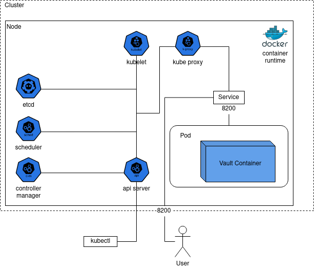

University: [ITMO University](https://itmo.ru/ru/)
Faculty: [FICT](https://fict.itmo.ru)
Course: [Introduction to distributed technologies](https://github.com/itmo-ict-faculty/introduction-to-distributed-technologies)
Year: 2023/2024
Group: K4110c
Author: Efimov Andrey Mikhailovich
Lab: Lab1
Date of create: 03.10.2023
Date of finished: 


# Запуск Minikube
После установки Docker ([installation](https://docs.docker.com/engine/install/)) и minikube ([installation](https://minikube.sigs.k8s.io/docs/start/)) впервые запустим minikube командой:

```
minikube start
```

Результат:


Флаг ```driver``` не был указан, потому что кроме docker на машине не установлено альтернатив.

# Скачивание контейнера
[Скачаем](https://hub.docker.com/r/hashicorp/vault) изображение контейнера командой:

```
docker pull hashicorp/vault
```

Проверить наличие изображения можно командой:

```
docker images
```

Результат выполнения:


# Создание manifest.yaml
Для получения первого манифест-файла можно воспользоваться командой:

```
minikube kubectl -- run vault --image=hashicorp/vault --port=8200 -o yaml --dry-run=client
```

Результат выполнения:


Пояснение ([docs](https://kubernetes.io/docs/reference/generated/kubectl/kubectl-commands)):
- `run` - запускает 1 или больше образцов изображений контейнера в кластере;
- `vault` - имя пода;
- `--image` - указывает имя изображения, используемое для создания пода, в нашем случае это `hashicorp/vault`;
- `--port` - порт, который будет открыт для контейнера;
- `-o` - формат вывода, используем `yaml`, но можно и ;
- `--dry-run` - используем значение `client`, чтобы только вывести в консоль, без отправки на сервер

Можно скопировать результат в новый файл `manifest.yaml`, удалив неважные на данном этапе поля:
- `creationTimestamp` - поле, указывающее время создания объекта;
- `resources` - заправшиваемые ресурсы, такие как `memory` и `cpu` ([docs](https://kubernetes.io/docs/concepts/configuration/manage-resources-containers/));
- `dnsPolicy` - DNS позволяет обращаться к сервису по имени, вместо IP адреса, параметр позволяет определить поведение разрешения DNS имен ([docs](https://kubernetes.io/docs/concepts/services-networking/dns-pod-service/));
- `status` - описывает текущее состояние объекта ([docs](https://kubernetes.io/docs/concepts/overview/working-with-objects/#object-spec-and-status)).

Опишем оставшиеся поля:
- `apiVersion` - параметр, описывающий группу и версию объекта. Так как `Pod` не имеет группы, используем только версию `v1`. Найти `apiVersion` для других объектов можно командой `minikube kubectl -- api-resources`;
- `kind` - тип объекта, в данном случае `Pod`;
- `labels` - пары ключ/значение, которые прикрепляются к объекту. Предназначены для идентификации объекта. Автоматически была создана пара `run: vault`;
- `metadata/name` - имя объекта, автоматически назначилось значение `vault` после выполнения команды;
- `containers/image` - имя изображения, используемого для контейнера;
- `containers/name` - имя контейнера;
- `containers/ports/containerPort` - открываемый порт контейнера.

# Создание пода
Чтобы создать под по `mainfest.yaml`, нужно, находясь в папке с файлом, использовать команду:
```
minikube kubectl -- create -f manifest.yaml
```

Результат:


Проверить поды можно командой:
```
minikube kubectl -- get pods
```

# Доступ к поду
Чтобы получить доступ к поду, нужно создать сервис, перенаправляющий с одного порта, на порт пода. Это можно сделать командой:
```
minikube kubectl -- expose pod vault --type=NodePort --port=8200
```

Далее нужно перенаправлять запросы на созданный сервис:
```
minikube kubectl -- port-forward service/vault 8200:8200
```

Пояснение:
- `port-forward` - команда для перенаправления запросов;
- `service/vault` - имя созданного сервиса;
- `8200:8200` - первое число - порт, по которому будет происходить доступ к приложению, второе - порт, который был открыт на этапе создания объекта.

Результат:


Теперь можно открыть приложение в браузере по адресу `localhost:8200`


Для того, чтобы аутентифицироваться, нужно ввести `root-token`, который пишется в консоль при старте `hashicorp/vault`. Чтобы получить доступ, нужно открыть логи пода командой:

```
minikube kubectl -- logs vault
```

Для удобства вывода можно воспользоваться командой ```tail```:

Результат:


Теперь, найдя `root-token`, можно зайти в приложение:


# Схема организации контейнеров

