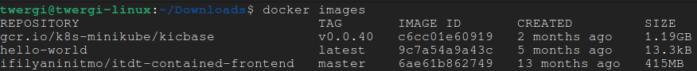
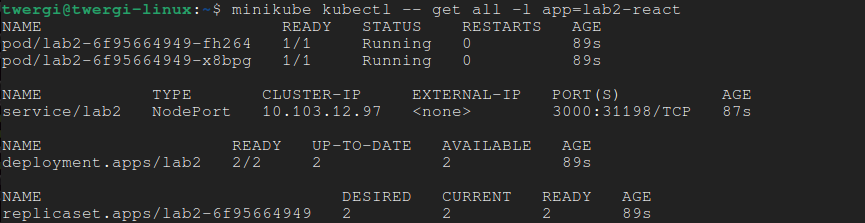
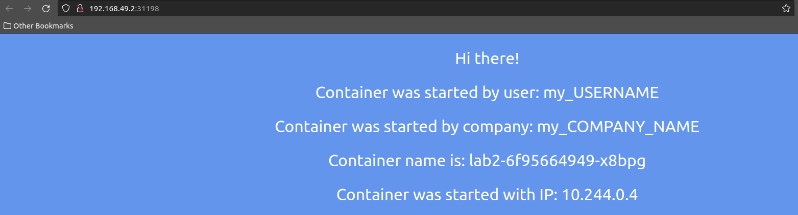
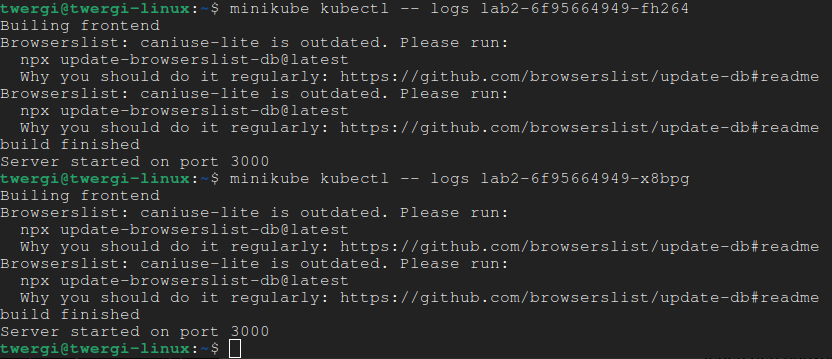
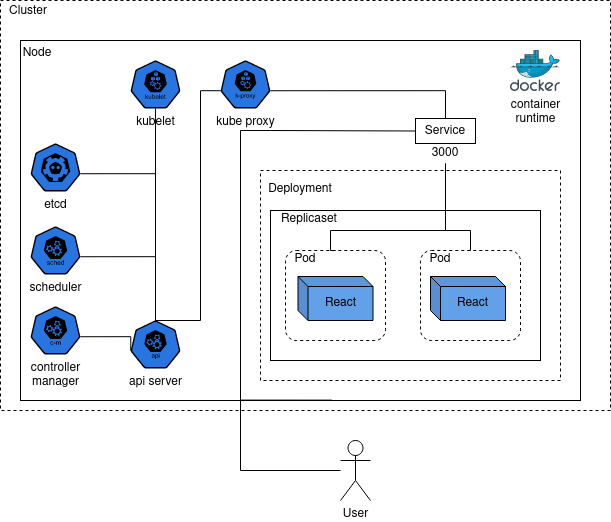

University: [ITMO University](https://itmo.ru/ru/)
Faculty: [FICT](https://fict.itmo.ru)
Course: [Introduction to distributed technologies](https://github.com/itmo-ict-faculty/introduction-to-distributed-technologies)
Year: 2023/2024
Group: K4110c
Author: Efimov Andrey Mikhailovich
Lab: Lab2
Date of create: 11.10.2023
Date of finished: 


# Скачивание изображения контейнера
Для скачивания [изображения](https://hub.docker.com/r/ifilyaninitmo/itdt-contained-frontend) используем команду:

```
docker pull ifilyaninitmo/itdt-contained-frontend:master
```

После скачивания проверим список скачанных изображений командой:

```
docker images
```

Результат:




# Создание manifest для deployment
Deployment - объект, позволяющий описать состояние pod-ов и replicaset-ов. Replicase - объект, обеспечивающий работу заданного количества pod-в в любое время, то есть отвечает за их создание, перезапуск и удаление.

Манифест для deployment - файл `deploy-manifest.yaml`. Его ключевые поля:
- `kind` - тип объекта, в данном случае `Deployment`;
- `spec/replicas` - назначает количество pod-ов для replicaset-а, в данном случае `2`;
- `spec/template/spec/containers/image` - название изображения контейнера, в данном случае `ifilyaninitmo/itdt-contained-frontend:master`;
- `spec/template/spec/containers/env` - задает аргументы окружения контейнера, по заданию лабораторной работы нужно установить значения для `REACT_APP_USERNAME` и `REACT_APP_COMPANY_NAME`, назначим любые значения;
- `spec/template/spec/containers/ports/containerPort` - открываемые порты для контейнера, так как приложение React работает на порте 3000, его и впишем.

Создадим deployment с помощью команды:
```
minikube kubectl -- create -f deploy_manifest.yaml
```

Результатом выполнения будет ответ:

```
deployment.apps/lab2 created
```

# Создание manifest для service
Service нужен для получения доступа к контейнерам как внутри кластера, так и извне. Так как по заданию требуется получить доступ из браузера, то следует выбрать тип service - `NodePort`.

Манифест для deployment - файл `svc-manifest.yaml`. Его ключевые поля:
- `kind` - тип объекта, в данном случае `Service`;
- `spec/type` - тип service, в данном случае `NodePort`;
- `spec/ports` - порт контейнера, так как был открыт порт 3000, то его и впишем.

Создадим service с помощью команды:
```
minikube kubectl -- create -f svc_manifest.yaml
```

Результатом выполнения будет ответ:

```
service/lab2 created
```

# Проверка работы
Чтобы проверить, что все объекты успешно созданы и работают, воспользуемся командой:
```
minikube kubectl -- get all -l app=lab2-react
```
Команда выводит все объекты, относящиеся к приложению, которое мы создали.

Результат выполнения:



Можно увидеть, что были созданы:
- Deployment - 1;
- Replicaset - 1;
- Pod - 2;
- Service - 1.

Чтобы увидеть результат в браузере, нужно воспользоваться командой:
```
minikube service lab2
```
Команда по умолчанию откроет адрес, на котором работает `minukube` с портом, на котором работает `Service`.

Результат выполнения:



Можно заметить, что используются наши заданные значения для `user` и `company`.
Если обновлять страницу сочетанием `CTRL+SHIFT+R` (перезагружая весь контент), то можно заметить, что IP-адрес и имя контейнера меняются. Это происходит потому, что service автоматически выполняет функцию load-balancer-а, обращаясь к одному из работающих контейнеров, который выбирается случайным образом. 

Для получения логов контейнеров воспользуемся командой:

```
minikube kubectl -- logs <pod-name>
```
где `pod-name` - имя интересующего нас пода. Имена подов можно найти командой `minikube kubectl -- get pods`

Результат:



# Схема организации контейнеров

