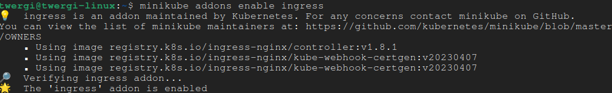

University: [ITMO University](https://itmo.ru/ru/)
Faculty: [FICT](https://fict.itmo.ru)
Course: [Introduction to distributed technologies](https://github.com/itmo-ict-faculty/introduction-to-distributed-technologies)
Year: 2023/2024
Group: K4110c
Author: Efimov Andrey Mikhailovich
Lab: Lab3
Date of create: 02.11.2023
Date of finished: 09.11.2023


В начале лабораторной работы стоит отметить, что за основу взяты манифесты, созданные в лабораторной работе №2.

# Создание ConfigMap

Создадим новый ConfigMap, используя манифест. Пояснение полей:
- `metadata.name` - название ConfigMap;
- `data` - хранимые данные в виде "ключ: значение". В данном случае добавим ключ `REACT_APP_USERNAME` и `REACT_APP_COMPANY_NAME`.

Создать ConfigMap в кластере можно командой:

```
minikube kubectl -- create -f ./configMap.yaml
```

Результат выполнения:


# Создание ReplicaSet
Для создания ReplicaSet, в котором будем использовать ConfigMap, воспользуемся манифестом для Deployment, выполненным в предыдущей работе. Поясним новые поля:
- `spec.template.spec.containers.envFrom` - позволяет добавить переменные в окружение, используя объекты:
  - `configMapRef` - в качестве источника переменных окружения будем использовать только что созданный ConfigMap:
    - `name` - имя используемого объекта.

# Включение Ingress

Включим аддон Ingress в minikube командой:

```
minikube addons enable ingress
```

Результат:



# Создание Certificate Authority (CA)
Для установки защищенного соединения, нужно создать сертификат, а для того, чтобы этот сертификат можно было подтвердить, нужно создать Certificate Authority.

Для создания воспользуемся командой:

```
openssl req \
    -x509 \
    -newkey rsa:2048 \
    -sha256 \
    -noenc \
    -days 3650 \
    -subj "/CN=lab3CA/C=RU/L=SPb" \
    -keyout ca_private.key \
    -out ca_cert.pem
```

Поясним флаги:
- `req` - создание запроса на сертификат;
- `-x509` - позволяет создать сертификат, вместо создания запроса;
- `-newkey rsa:2048` - создает новый приватный ключ, `rsa` - алгоритм шифрования, `2048` - длина ключа в битах;
- `-sha256` - алгоритм хэширования;
- `-noenc` - отключает шифрование приватного ключа;
- `-days 3650` - срок годности сертификата;
- `subj` - введенные значения интересующих полей, чтобы не вводить в интерактивном режиме;
- `-keyout ca_private.key` - вывод в файл приватного ключа;
- `-out ca_cert.pem` - вывод сертификата.

По итогу в текущей дериктории появилось два файла - `ca_cert.pem` и `ca_private.key`.

# Создание сертификата сервера
Для того, чтобы создать сертификат сервера, нужно:
1. Создать запрос на подпись сертификата (Certificate Signing Request (CSR));
2. Подписать сертификат созданным CA.

Для создания CSR используем команду:

```
openssl req \
    -newkey rsa:2048 \
    -sha256 \
    -noenc \
    -days 365 \
    -subj "/CN=lab3/C=RU/L=SPb" \
    -keyout server_private.key \
    -out server_cert.csr
```

В результате выполнения команды получим два новых файла `server_cert.csr` и `server_private.key`.

Далее нужно подписать созданный CSR. Это можно сделать с помощью команды:

```
openssl x509 \
    -req \
    -in server_cert.csr \
    -CA ca_cert.pem \
    -CAkey ca_private.key \
    -days 365 \
    -extfile ./extensions.txt \
    -out server_cert.pem
```

Поясним ключи, содержащиеся в файле `extensions.txt`:
- `subjectAltName` - альтернативные имена создаваемого субъекта, в данном случае установим значение для `DNS`, но возможны также и другие варианты;
- `authorityKeyIdentifier` - разрешает установку для двух значений:
  - `keyid` копирует идентификационный ключ из родительского сертификата;
  - `issuer` копирует эмитента и серийный номер из сертификата эмитента;
- `basicConstraints` - нужно для присваиванию ключу `CA` значения `FALSE`, что говорит о том, что сертификат не явялется Certificate Authority;
- `keyUsage` - регулирует разрешенные использования ключа:
  - `digitalSignature` - разрешение на применение цифровой подписи;
  - `keyEncipherment` - разрешение на шифрование симметричного ключа;
- `extendedKeyUsage` - регулирует разрешенные цели использования публичного ключа сертификата:
  - `serverAuth` - SSL/TLS аутентификация веб сервера

По итогу выполнения пунктов, связанных с созданием сертификата, были созданы и задействованы файлы:
- `ca_cert.pem` - корневой сертификат (Certificate Authority);
- `ca_private.key` - приватный ключ корневого сертификата (Certificate Authority);
- `server_cert.csr` - файл запроса на подпись сертификата (Certificate Signing Request);
- `extensions.txt` - конфигурационный файл, содержащий дополнительные поля и их значения, для подписи сертификата сервера;
- `server_cert.pem` - сертификат сервера;
- `server_private.key` - приватный ключ сертификата сервера.

# Добавление сертификата в minikube
Создадим новый `Secret`, хранящий созданный сертификат для сервера. Для этого воспользуемся командой:

```
minikube kubectl -- create secret tls my-cert --key server_private.key --cert server_cert.pem
```

После чего настроим аддон Ingress:

```
minikube addons configure ingress
```

Команда в интерактивном режиме спросит namespace и название секрета, хранящего сертификат. Вводим значение `default/my-cert`

# Создание Ingress
Ingress нужен для создания пути извне кластера к внутренним элементам. Манифест для создания представлен в файле `ingress.yaml`. Поясним поля:
- `spec`:
  - `ingressClassName` - имя ресурса кластера IngressClass;
  - `tls` - конфигурация TLS:
    - `hosts` - список доменов, включенных в сертификат, должны совпадать с именами в используемом `Secret`;
    - `secretName` - имя используемого `Secret`; 
  - `rules`:
    - `host` - имя домена;
    - `http` - список селекторов путей в URL к бэкендам;
      - `paths` - список путей к бэкендам:
        - `path` - путь, на который поступает запрос;
        - `pathType` - определяет интерпретацию сопоставления путей. `Exact` означает, что путь запроса должен полностью совпадать с `path`;
        - `backend` - определяет используемый `Service` для данного пути, куда будет перенаправлен трафик.

Создадим описанный Ingress командой:

```
minikube kubectl -- create -f ingress.yaml
```

# Проверка отображения сертификата
Для того, чтобы бразуер мог убедиться в достоверности переданного сертификата, нужно добавить созданный Certificate Authority в список доверенных в самом браузере.

Также чтобы осуществить доступ к кластеру через DNS-имя, нужно создать запись в файле `hosts`. Чтобы узнать IP, на котором работает Ingress, воспользуемся командой:

```
minikube kubectl -- get ingress
```

Тогда запись, которую нужон добавить в файл `hosts` имеет вид:

```
192.168.49.2    lab3.com
```

Результат в браузере:


Сертификат:


Подробное описание сертификата:


# Схема организации контейнеров


