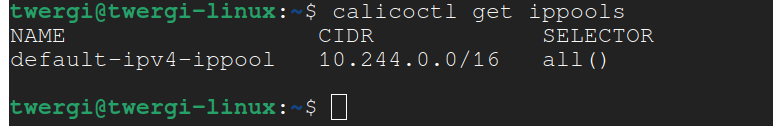
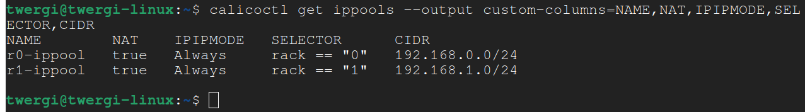
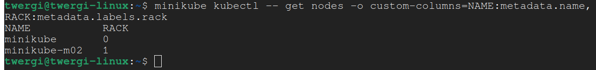
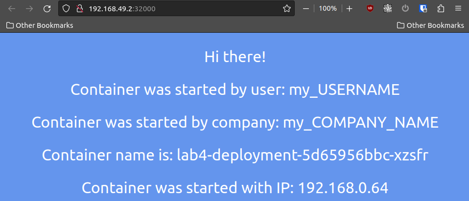
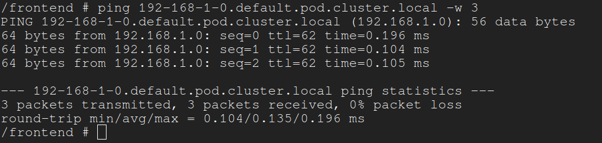
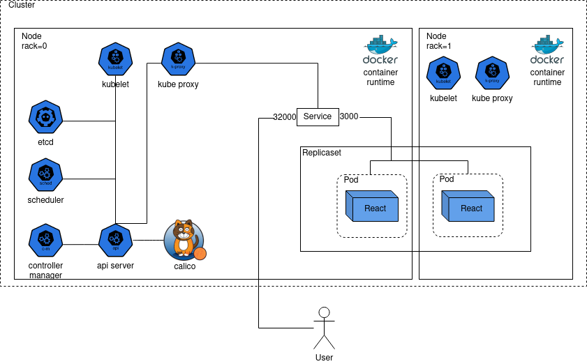

University: [ITMO University](https://itmo.ru/ru/)
Faculty: [FICT](https://fict.itmo.ru)
Course: [Introduction to distributed technologies](https://github.com/itmo-ict-faculty/introduction-to-distributed-technologies)
Year: 2023/2024
Group: K4110c
Author: Efimov Andrey Mikhailovich
Lab: Lab4
Date of create: 05.11.2023
Date of finished:


# Запуск minikube
Calico - решение для сетей и безопасности, которое позволяет рабочим элементам кластера Kubernetes общаться друг с другом беспрепятственно и безопасно. Calico уже встроен в стандартную установку minikube, поэтому для запуска, используя CNI (Container Network Interface) Calico и 2-мя нодами, воспользуемся командой:

```
minikube start --nodes 2 --network-plugin=cni --cni=calico
```

# Настройка IPPools
Для того, чтобы мы могли разделить подсети на ноды, нужно создать `IPPool`-ы, которые представляют собой диапазоны IP-адресов, которые используются при назначении IP подам. Проверим существующие `IPPools` командой:

```
calicoctl get ippools
```

Результат:



Как можно видеть, автоматически был создан `IPPool` `default-ipv4-ippool`. Удалим его командой:

```
calicoctl delete ippools default-ipv4-ippool
```

Для создания своих `IPPool` будем использовать манифесты. Опишем поля:
- `spec.cidr` - адрес и маска сети;
- `ipipMode` - регулирует режим использования `IP-in-IP`, который инкапсулирует исходный IP-пакет во внешний. При режиме `Always`, Calico маршрутизирует трафик, используя IP в IP для всего трафика, исходящего от хоста с поддержкой Calico, ко всем сетевым контейнерам и виртуальным машинам Calico в пуле IP;
- `natOutgoing` - позволяет подам внутри сети получать доступ к внешним IP адресам, используя технологию NAT;
- `nodeSelector` - параметр выбора `Node` для селектора.

Создадим новые `IPPool`-ы с помощью команды:

```
calicoctl create --filename=ippool0.yaml && calicoctl create --filename=ippool1.yaml
```

Убедимся в создании `IPPool` командой:

```
calicoctl get ippools --output custom-columns=NAME,NAT,IPIPMODE,SELECTOR,CIDR
```

Результат:



Установим соответствующие `label` для `Node` командой:

```
minikube kubectl -- label node minikube rack=0 && minikube kubectl -- label node minikube-m02 rack=1
```

Убедимся в установке новых `label` командой:

```
minikube kubectl -- get nodes -o custom-columns=NAME:metadata.name,RACK:metadata.labels.rack
```

Результат:




# Создание Deployment и Service
`Deployment` и `Service` создадим используя манифесты, созданные в lab2.

# Проверка работы в браузере
Чтобы увидеть результат в браузере, нужно воспользоваться командой:
```
minikube service lab4-service
```
Команда по умолчанию откроет адрес, на котором работает `minukube` с портом, на котором работает `Service`.

Результат выполнения:



Если обновлять страницу сочетанием `CTRL+SHIFT+R` (перезагружая весь контент), то можно заметить, что IP-адрес и имя контейнера меняются. Это происходит потому, что service автоматически выполняет функцию load-balancer-а, обращаясь к одному из работающих контейнеров, который выбирается случайным образом.

# Ping Pod
Чтобы выполнить `ping` от одного `Pod` другому, нужно сначала запустить терминал в одном из них. Выберем один из подов, которые можно найти командой:

```
minikube kubectl -- get pods
```

Далее, чтобы запустить терминал, выполним команду:

```
minikube kubectl -- exec -it lab4-deployment-5d65956bbc-xzsfr -- /bin/sh
```

- `lab4-deployment-5d65956bbc-xzsfr` - имя выбранного `Pod`.

Далее, определив FQDN в соответствии с [документацией](https://kubernetes.io/docs/concepts/services-networking/dns-pod-service/#pods), выполним `ping` к другому `Pod`:

```
ping 192-168-1-0.default.pod.cluster.local -w 3
```

Результат:



# Схема организации контейнеров

